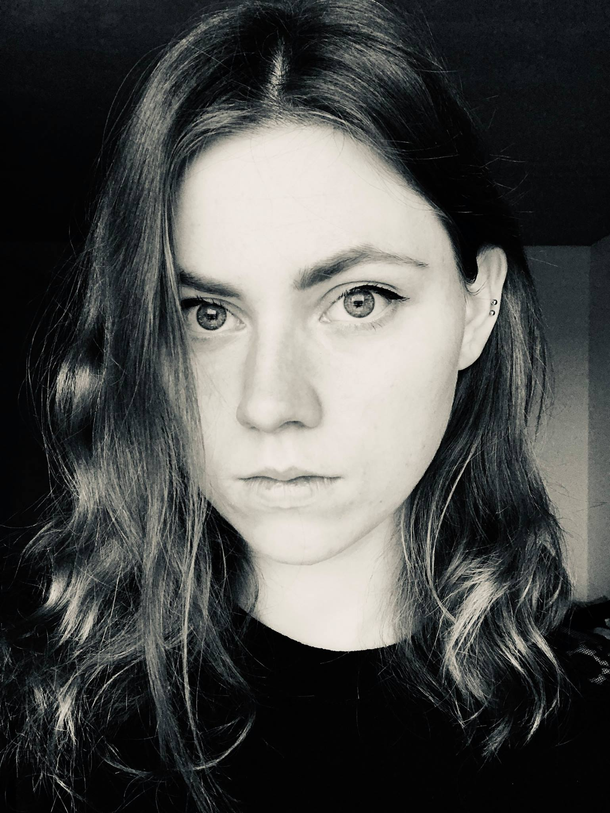

<!-- {:height="250px"} -->

 My name is Loïc Herviou, and I am a Condensed Matter theorist, working on both analytics and numerics, at the [LPMMC](https://lpmmc.cnrs.fr/?lang=fr) in Grenoble.

I am interested and working on different aspects of modern condensed matter: topology, dissipation and thermalization. I am currently contributing to [ITensors.jl](https://github.com/ITensor/ITensors.jl) for the development.

You can find all my publications on [arXiv](https://arxiv.org/search/?searchtype=author&query=Herviou%2C+L).

During my free time: [HEMA](http://unilamhe.ch/en/), martial arts, hiking and gaming.

