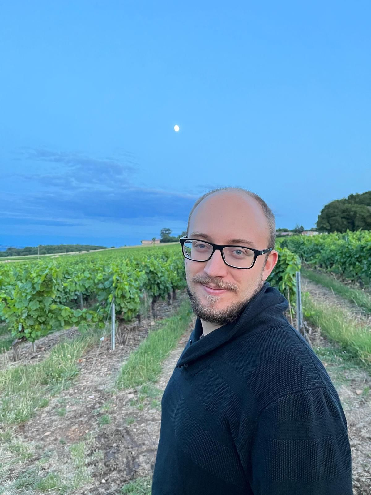

<!-- {:height="250px"} -->

 My name is Loïc Herviou, and I am a Condensed Matter theorist, working on both analytics and numerics, at the [LPMMC](https://lpmmc.cnrs.fr/?lang=fr) in Grenoble.

I am interested and working on different aspects of modern condensed matter: topology, dissipation and thermalization. Topology in CM is characterized by the global geometrical properties of the electronic wavefunctions which can have direct experimental consequences, such as the quantization of the Hall current in the Fractional and Integer quantum Hall effect. Dissipation describes the loss of information of a quantum system through its coupling with an environment or an external system. Thermalization can also be seen as a loss of information, but from local accessible degrees of freedom to non-local ones such that an isolated quantum system relaxes to a state indistinguishable from a thermal state.

To study these topics, I am using both analytical techniques, in particular quantum field theory and different renormalization approaches, but also and mainly numerical tools. I am working mainly with exact diagonalization and matrix product state methods. I am currently contributing to [ITensors.jl](https://github.com/ITensor/ITensors.jl), for example.

You can find all my publications on [arXiv]( http://arxiv.org/a/herviou_l_1).

During my free time: [HEMA](http://unilamhe.ch/en/), martial arts, hiking and gaming.

